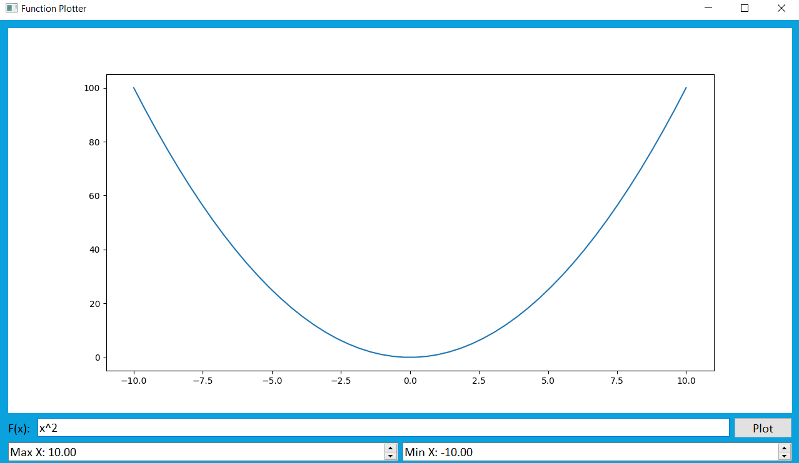
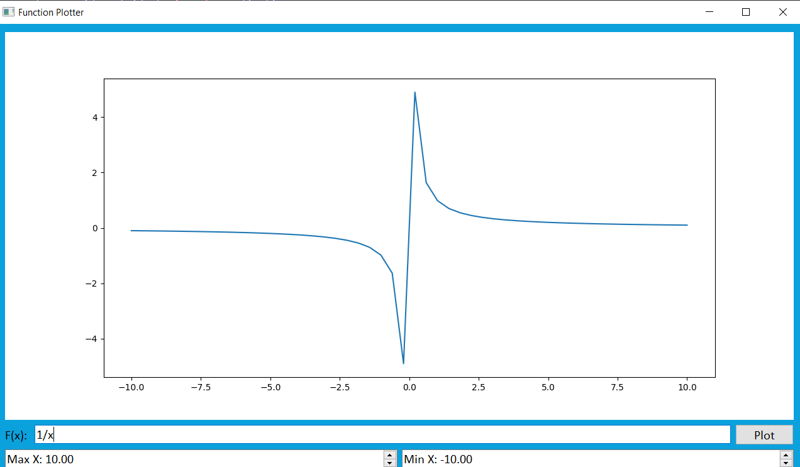
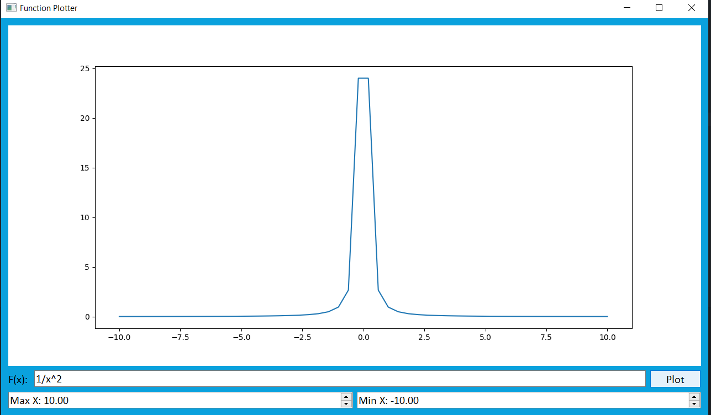
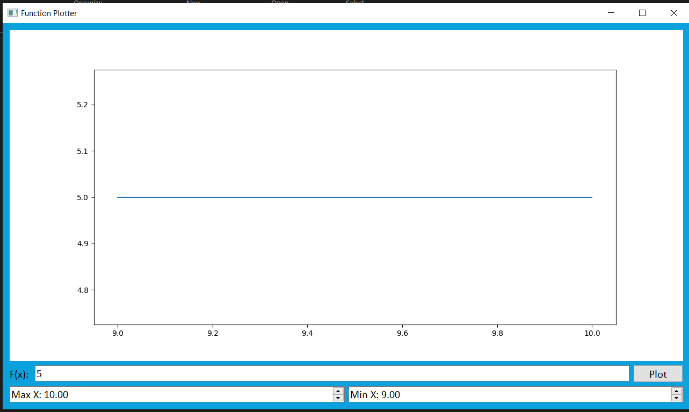
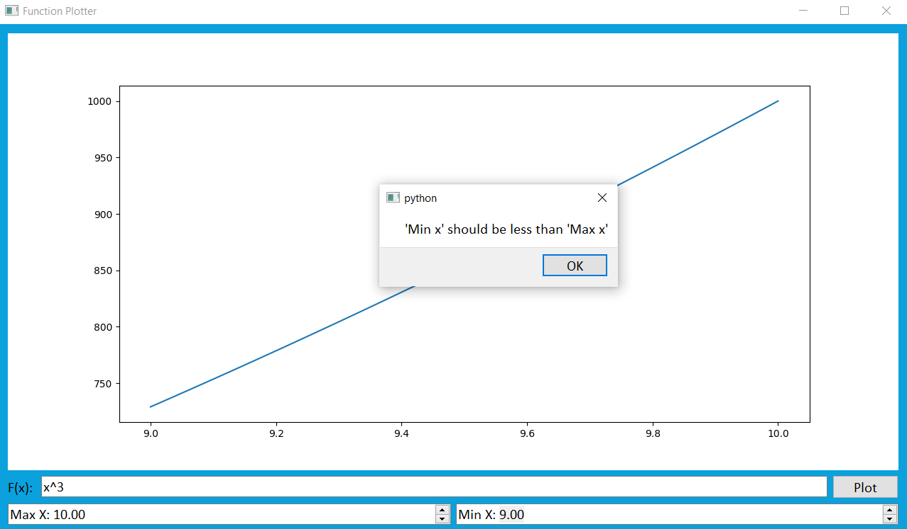
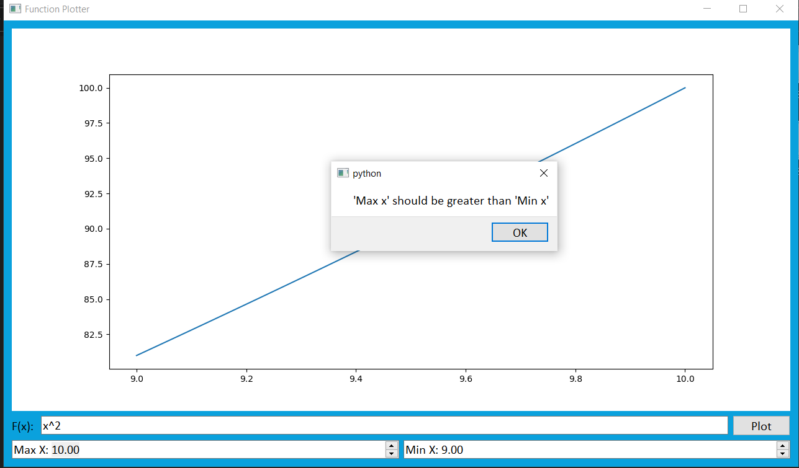
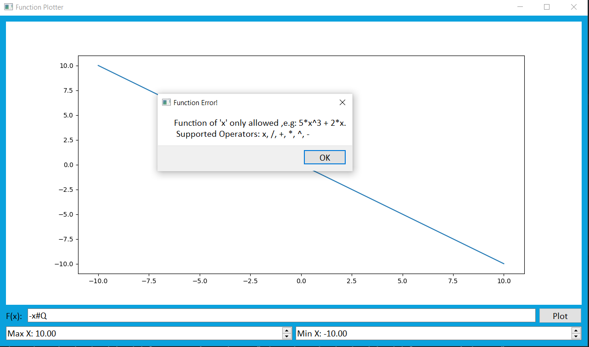

 # Function  Plotter

GUI program that plots arbitrary user-entered function using python

## Description
* Take a function of x from the user, e.g., 5*x^3 + 2*x. 
* Take min and max values of x from the user. 
* The following operators are supported: + - / * ^.

## Getting Started

### Dependencies

* PySide2
* matplotlib

### Installing

```
git clone https://github.com/ZiadSheriif/Function-plotter 
```

```
pip install PySide2
```

```
pip install matplotlib
```

```
pip install nympy
```

### Executing program

```
python run.py
```
### Screenshots

#### Graphs








#### Error messages



